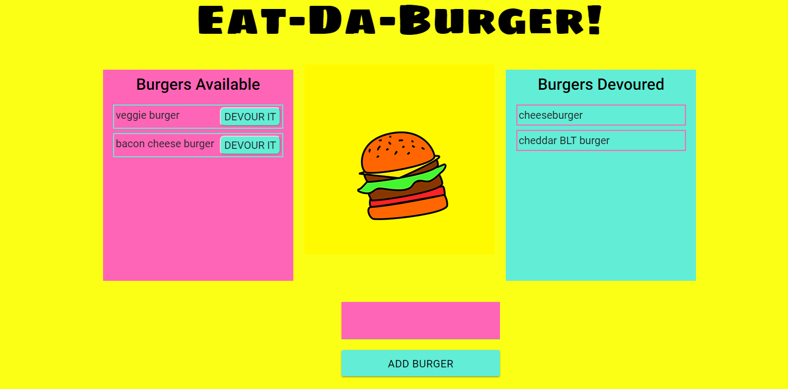

#  Eat-Da-Burger! 

Eat-Da-Burger! is a restaurant app that lets users input the names of burgers they'd like to eat. When the user submits a burger's name, the app displays the burger on the left side of the page -- waiting to be devoured. Each burger in the **Available Burgers** waiting area has a `DEVOUR IT` button. When the user clicks it, the burger moves to the right side of the page, under **Burgers Devoured**.

## Demo

Eat-Da-Burger is hosted on Heroku. Check it out by [clicking here].

## Technologies Used

* MySQL
* Node.js
* Express
* Handlebars
